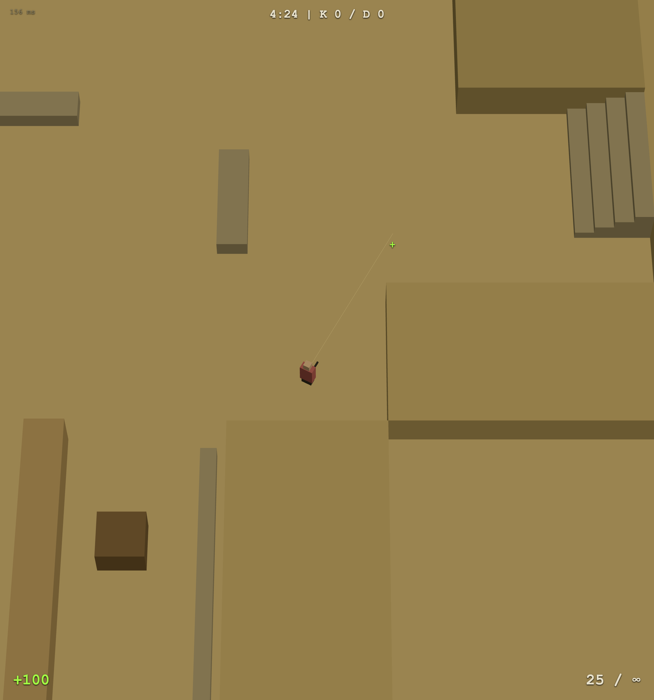

# Dust Arena

Top-down multiplayer arena shooter в духе de_dust из Counter-Strike — браузерный, без сборки, реалтайм на WebSocket. Brawl-Stars-подобная телефото-камера сверху, непрерывный командный дезматч.

**🎮 Live demo:** https://dust-arena-production.up.railway.app/



## Что внутри

- **Реалтайм-мультиплеер** на `ws` — комнаты, автобаланс команд (ORANGE vs BLUE), интерполяция ремоутов (рендер на 120ms в прошлом).
- **Авторитетный сервер** — урон, дальность, скорострельность, попадания валидируются на сервере (клиенту с числами урона не верят).
- **5 стволов через точки-пикапы** на карте + дефолтный rifle на спавне. Подбор как у медкита: наступил → получил ствол, точка гаснет на 20с, смерть откатывает на rifle.
- **Бесконечный матч** без раундового таймера — медкиты, спавн-протекция, стрик-баннеры (ON FIRE / RAMPAGE / GODLIKE), тонты, киллфид и скорборд.
- **Звук** — SFX, русский голос-аннонсер и фоновая музыка сгенерированы через ElevenLabs (`tools/gen-sfx.mjs`); SFX имеют процедурный фолбэк.
- **Карта** — единый источник правды `public/map.json` (генератор `tools/gen_map.py`), одинаково читается сервером и клиентом.

### Арсенал

| Ствол   | Урон | Скоростр. | Дальность | Магазин | Роль |
|---------|------|-----------|-----------|---------|------|
| RIFLE   | 18   | 110ms     | 40        | 30      | дефолт спавна |
| SMG     | 12   | 70ms      | 30        | 40      | быстрый спрей |
| DEAGLE  | 50   | 350ms     | 36        | 7       | 2 тяжёлых тапа |
| SHOTGUN | 65   | 650ms     | 14        | 6       | ваншот в упор |
| AWP     | 100  | 1500ms    | 62        | 5       | ваншот-килл, дальнобой |
| LMG     | 16   | 90ms      | 38        | 100     | пулемёт |

## Запуск локально

```bash
npm install
npm start            # слушает :3000 (или $PORT)
```

Открой http://localhost:3000 — для дуэли открой две вкладки или раздай ссылку. Спектатор-вид сверху: `?spectate=1`.

### Управление

| | |
|---|---|
| WASD | движение |
| Mouse | прицел |
| LMB | огонь |
| Space | прыжок |
| R | перезарядка |
| Shift | медленный шаг |
| Tab | таблица счёта |
| M | звук вкл/выкл |
| 1–4 | тонты (EZ / NICE SHOT / RUSH B / HELP!) |

## Стек

- **Сервер:** Node.js + Express + `ws` (`server.js`). State broadcast 20 Гц, тик 50ms.
- **Клиент:** three.js (ESM через CDN, без бандлера) в одном `public/index.html`.
- **Деплой:** Railway (`npm start`).

## Как это сделано

Игра собрана вживую на стриме вайбкодингом — задачи ставились AI-агентам через промпты (оригинальные промпты — в `prompt.md`, дизайн-ревью — в `design-review.md`).

Бэклог и задачи фич — в [Issues](../../issues): каждая задача самодостаточна, issue = единственный источник правды.

- 📺 Стрим: https://youtube.com/live/eguZQ4MAh8U
- ✍️ Разбор: https://sereja.tech/blog/claude-fable-5-review

## Лицензия

[MIT](LICENSE)
